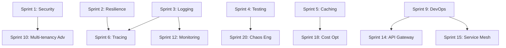

# MCP Holded - Plan de Trabajo Enterprise-Grade Pro

## Tabla de Contenidos
1. [Visión General](#visión-general)
2. [Definición de MVP Pro-Level](#definición-de-mvp-pro-level)
3. [Roadmap Detallado](#roadmap-detallado)
4. [Matriz de Priorización](#matriz-de-priorización)
5. [Cronograma y Estimaciones](#cronograma-y-estimaciones)
6. [Métricas de Éxito](#métricas-de-éxito)
7. [Dependencias y Riesgos](#dependencias-y-riesgos)

---

## Visión General

**Objetivo**: Transformar el MCP Holded de un servidor funcional a una solución enterprise-grade lista para producción que soporte:
- Alta disponibilidad (99.9% uptime)
- Escalabilidad horizontal (100+ usuarios concurrentes)
- Seguridad enterprise (SOC 2, GDPR compliance)
- Observabilidad completa (metrics, logs, traces)
- Multi-tenancy con aislamiento de datos
- Documentación y soporte profesional

**Duración Total**: 9-11 meses
**Equipo Recomendado**: 2-3 developers full-time

---

## Definición de MVP Pro-Level

### Características Mínimas para Producción

#### ✓ Funcionalidad Core (YA IMPLEMENTADO)
- [x] Integración completa con Holded API (15+ tools)
- [x] Soporte de documentos, contactos, productos
- [x] Virtual pagination para grandes datasets
- [x] Tests unitarios (124 tests)
- [x] Build y CI básico

#### 🔄 MVP Pro-Level (SPRINT 1-6)
- [ ] Autenticación segura con rotación de API keys
- [ ] Rate limiting inteligente con backoff
- [ ] Circuit breaker para resilience
- [ ] Logging estructurado con contexto
- [ ] Health checks y monitoring básico
- [ ] Error handling robusto con retry logic
- [ ] Documentación completa de API
- [ ] Docker deployment

#### 🚀 Enterprise-Grade (SPRINT 7-20)
- [ ] Multi-tenancy con aislamiento
- [ ] Distributed tracing (OpenTelemetry)
- [ ] Advanced caching (Redis)
- [ ] Audit logging completo
- [ ] Compliance (GDPR, SOC 2)
- [ ] Blue-green deployments
- [ ] Chaos engineering tests
- [ ] SLA monitoring y alertas

---

## Roadmap Detallado

### 📋 FASE 1: Fundamentos de Producción (Semanas 1-8)

#### Sprint 1: Seguridad y Autenticación (Semana 1-2)
**Objetivo**: Sistema de autenticación seguro y multi-tenant

**Tareas**:
1. **Implementar gestión segura de API keys** (8h)
   - Soporte para variables de entorno cifradas
   - Integración con AWS Secrets Manager / HashiCorp Vault
   - Rotación automática de keys
   - Tests de seguridad

2. **Multi-tenancy básico** (13h)
   - Modelo de datos para tenants
   - Middleware de tenant context
   - Aislamiento de datos en requests
   - Tests de isolation

3. **Rate limiting inteligente** (8h)
   - Implementar sliding window algorithm
   - Rate limits por tenant y por endpoint
   - Headers de rate limit en responses
   - Tests de límites

**Entregables**:
- Sistema de gestión de API keys con vault integration
- Middleware de multi-tenancy
- Rate limiter configurable
- Documentación de configuración

**Métricas de Éxito**:
- 0 API keys en código o logs
- 100% de requests con tenant context
- Rate limiting < 1ms de overhead

---

#### Sprint 2: Resilience y Error Handling (Semana 3-4)
**Objetivo**: Sistema robusto que maneja fallos gracefully

**Tareas**:
1. **Circuit breaker pattern** (10h)
   - Implementar usando `opossum` library
   - Estados: closed, open, half-open
   - Configuración por endpoint
   - Dashboard de circuit breakers
   - Tests de failure scenarios

2. **Retry logic inteligente** (8h)
   - Exponential backoff con jitter
   - Retry solo en errores recuperables (5xx, network)
   - Max retries configurables
   - Telemetría de retries

3. **Error normalization** (5h)
   - Clase base para errores custom
   - Mapeo de errores de Holded API
   - Error codes estandarizados
   - Stack traces sanitizados

**Entregables**:
- Circuit breaker en todos los endpoints críticos
- Sistema de retry con backoff
- Catálogo de error codes
- Tests de resilience (chaos)

**Métricas de Éxito**:
- 0% de errores no manejados
- < 5% de requests con circuit breaker abierto
- Recovery time < 30s después de API downtime

---

#### Sprint 3: Logging y Observabilidad Básica (Semana 5-6)
**Objetivo**: Visibilidad completa de operaciones del sistema

**Tareas**:
1. **Structured logging** (8h)
   - Winston con formato JSON
   - Log levels: DEBUG, INFO, WARN, ERROR
   - Contexto enriquecido (requestId, tenantId, userId)
   - Rotation y retention policies
   - Integración con ELK stack

2. **Health checks** (5h)
   - `/health` endpoint (liveness)
   - `/ready` endpoint (readiness)
   - Checks: API connectivity, database, cache
   - Response time < 100ms

3. **Métricas básicas** (8h)
   - Prometheus metrics endpoint
   - Request duration histograms
   - Error rates por endpoint
   - Active connections gauge
   - Custom business metrics

**Entregables**:
- Sistema de logging con contexto
- Health checks para K8s
- Metrics endpoint compatible con Prometheus
- Dashboard básico en Grafana

**Métricas de Éxito**:
- 100% de requests loggeados con contexto
- Health checks response time < 100ms
- 0 logs con PII (Personally Identifiable Information)

---

#### Sprint 4: Testing y Quality Assurance (Semana 7-8)
**Objetivo**: Cobertura de tests enterprise-grade

**Tareas**:
1. **Aumentar cobertura de tests** (13h)
   - Target: 85%+ code coverage
   - Integration tests con Holded API sandbox
   - Contract tests (Pact)
   - Performance tests (k6)

2. **E2E tests** (8h)
   - Scenarios críticos de negocio
   - Tests de failure scenarios
   - Tests de rate limiting
   - Tests de multi-tenancy

3. **CI/CD pipeline avanzado** (8h)
   - GitHub Actions con matrix builds
   - Security scanning (Snyk, Trivy)
   - Performance regression tests
   - Automatic rollback on failures

**Entregables**:
- Test suite con 85%+ coverage
- E2E test suite automatizado
- CI/CD pipeline con quality gates
- Performance baseline establecido

**Métricas de Éxito**:
- Code coverage > 85%
- E2E tests < 5min execution time
- 0 security vulnerabilities high/critical
- CI pipeline < 10min

---

### 🏭 FASE 2: Producción Empresarial (Semanas 9-18)

#### Sprint 5: Caching y Performance (Semana 9-10)
**Objetivo**: Reducir latencia y carga en Holded API

**Tareas**:
1. **Implementar Redis caching** (13h)
   - Cache layer para operaciones read-heavy
   - TTL inteligente por tipo de dato
   - Cache invalidation strategies
   - Cache warming en startup
   - Cache hit rate monitoring

2. **Query optimization** (8h)
   - Batching de requests donde sea posible
   - Parallel fetching con Promise.all()
   - Pagination optimization
   - Lazy loading strategies

3. **Performance monitoring** (5h)
   - APM con New Relic / Datadog
   - Slow query detection
   - Memory profiling
   - CPU profiling en producción

**Entregables**:
- Redis cache con 80%+ hit rate
- Request batching implementado
- APM dashboard configurado
- Performance baselines documentados

**Métricas de Éxito**:
- P95 latency < 200ms
- Cache hit rate > 80%
- API calls reducidos en 60%
- Memory usage estable < 512MB

---

#### Sprint 6: Distributed Tracing (Semana 11-12)
**Objetivo**: Trazabilidad completa de requests

**Tareas**:
1. **OpenTelemetry integration** (10h)
   - SDK setup para Node.js
   - Auto-instrumentation de HTTP/fetch
   - Custom spans para business logic
   - Propagación de context (W3C Trace Context)

2. **Jaeger backend setup** (5h)
   - Docker compose para local dev
   - Production deployment (K8s)
   - Retention policies
   - Dashboard configuration

3. **Trace analysis y optimization** (8h)
   - Identificar bottlenecks
   - Optimize hot paths
   - Add business metadata to traces
   - Error tracking en traces

**Entregables**:
- OpenTelemetry totalmente integrado
- Jaeger UI con traces en producción
- Guía de troubleshooting con traces
- Performance improvements basados en traces

**Métricas de Éxito**:
- 100% de requests traced
- Trace overhead < 5ms
- 0 lost traces
- MTTR (Mean Time To Resolution) reducido en 50%

---

#### Sprint 7-8: Compliance y Audit (Semana 13-16)
**Objetivo**: Cumplir con regulaciones GDPR y SOC 2

**Tareas Sprint 7**:
1. **Audit logging completo** (13h)
   - Log de todas las operaciones CRUD
   - Metadata: who, what, when, where, why
   - Immutable log storage
   - Retention por 7 años
   - SIEM integration (Splunk)

2. **GDPR compliance** (10h)
   - Data mapping y inventory
   - Right to access (export user data)
   - Right to erasure (delete user data)
   - Data portability
   - Privacy by design

**Tareas Sprint 8**:
3. **SOC 2 Type II prep** (13h)
   - Access control documentation
   - Incident response procedures
   - Business continuity plan
   - Vendor management
   - Security awareness training

4. **Compliance testing** (8h)
   - Automated compliance checks
   - Regular security audits
   - Penetration testing
   - Vulnerability management

**Entregables**:
- Sistema de audit logging
- GDPR compliance framework
- SOC 2 documentation package
- Compliance dashboard

**Métricas de Éxito**:
- 100% de operaciones auditadas
- GDPR response time < 30 días
- 0 compliance violations
- Security audit score > 90%

---

#### Sprint 9: Deployment y DevOps (Semana 17-18)
**Objetivo**: Deployment enterprise-grade con zero downtime

**Tareas**:
1. **Containerization** (8h)
   - Multi-stage Dockerfile optimizado
   - Docker Compose para local dev
   - Image size < 200MB
   - Security scanning en build

2. **Kubernetes deployment** (13h)
   - Helm charts para deployment
   - HPA (Horizontal Pod Autoscaler)
   - Resource limits y requests
   - Liveness/readiness probes
   - ConfigMaps y Secrets

3. **Blue-green deployments** (8h)
   - Configurar 2 environments (blue/green)
   - Health check basado traffic switching
   - Rollback automático en failures
   - Canary releases

**Entregables**:
- Helm charts production-ready
- K8s cluster configurado
- Blue-green deployment automatizado
- Runbook de deployment

**Métricas de Éxito**:
- Deployment time < 5min
- Zero downtime deployments
- Rollback time < 2min
- Container startup time < 30s

---

### 🚀 FASE 3: Escalabilidad Avanzada (Semanas 19-26)

#### Sprint 10-11: Arquitectura Multi-tenancy Avanzada (Semana 19-22)
**Objetivo**: Aislamiento y escalabilidad por tenant

**Tareas Sprint 10**:
1. **Tenant isolation avanzado** (13h)
   - Database per tenant (opcional)
   - Schema per tenant
   - Connection pooling por tenant
   - Query isolation enforcement

2. **Resource quotas** (8h)
   - Rate limits por tenant tier
   - Storage limits
   - API call quotas
   - Cost allocation

**Tareas Sprint 11**:
3. **Tenant management** (13h)
   - Admin dashboard para tenant management
   - Provisioning automatizado
   - Billing integration
   - Usage analytics per tenant

4. **Cross-tenant analytics** (8h)
   - Aggregated metrics
   - Tenant health scores
   - Churn prediction
   - Resource usage forecasting

**Entregables**:
- Sistema de multi-tenancy robusto
- Tenant management portal
- Billing integration
- Analytics dashboard

**Métricas de Éxito**:
- 100% tenant data isolation
- Tenant provisioning < 5min
- Resource utilization > 70%
- Churn prediction accuracy > 80%

---

#### Sprint 12-13: Advanced Monitoring y Alerting (Semana 23-26)
**Objetivo**: Observabilidad y respuesta proactiva

**Tareas Sprint 12**:
1. **Advanced metrics** (10h)
   - Business metrics (orders, revenue)
   - SLIs (Service Level Indicators)
   - SLOs (Service Level Objectives)
   - Error budgets

2. **Alerting inteligente** (8h)
   - PagerDuty/Opsgenie integration
   - Smart alert routing
   - Escalation policies
   - Alert fatigue reduction

**Tareas Sprint 13**:
3. **Dashboards avanzados** (8h)
   - Executive dashboard (business metrics)
   - Operations dashboard (technical metrics)
   - Tenant-specific dashboards
   - Public status page

4. **SRE practices** (13h)
   - On-call rotation
   - Postmortem templates
   - Runbooks para common issues
   - Disaster recovery drills

**Entregables**:
- Sistema de alerting inteligente
- Dashboards multi-nivel
- SLI/SLO framework
- SRE playbooks

**Métricas de Éxito**:
- MTTD (Mean Time To Detect) < 5min
- MTTR (Mean Time To Resolve) < 30min
- Alert noise reduction > 70%
- SLO compliance > 99.9%

---

### 🎯 FASE 4: Features Enterprise Premium (Semanas 27-40)

#### Sprint 14-15: API Gateway y Service Mesh (Semana 27-30)
**Objetivo**: Centralizar control de APIs y service-to-service communication

**Tareas Sprint 14**:
1. **Kong API Gateway** (13h)
   - Setup y configuración
   - Rate limiting en gateway
   - Authentication plugins
   - Request/response transformation

2. **Service mesh (Istio)** (13h)
   - Sidecar injection
   - Traffic management
   - Mutual TLS (mTLS)
   - Circuit breaking en mesh

**Tareas Sprint 15**:
3. **API versioning** (8h)
   - Semantic versioning strategy
   - Backward compatibility tests
   - Deprecation policies
   - Version sunset process

4. **Developer portal** (13h)
   - API documentation con Swagger/OpenAPI
   - Try-it-out sandbox
   - API key management
   - Usage analytics

**Entregables**:
- Kong Gateway en producción
- Service mesh configurado
- API versioning framework
- Developer portal público

**Métricas de Éxito**:
- Gateway latency < 10ms
- API documentation coverage 100%
- Developer onboarding time < 1 hour
- API adoption rate > 50%

---

#### Sprint 16-17: Advanced Security (Semana 31-34)
**Objetivo**: Security hardening enterprise-grade

**Tareas Sprint 16**:
1. **Zero-trust architecture** (13h)
   - Identity-based access control
   - Continuous verification
   - Least privilege access
   - Micro-segmentation

2. **Secrets management** (8h)
   - HashiCorp Vault integration
   - Dynamic secrets
   - Secret rotation automation
   - Audit trail de acceso

**Tareas Sprint 17**:
3. **Penetration testing** (13h)
   - External penetration test
   - Internal security audit
   - Vulnerability remediation
   - Security report

4. **WAF y DDoS protection** (8h)
   - Cloudflare/AWS WAF setup
   - DDoS mitigation rules
   - Bot protection
   - Geographic restrictions

**Entregables**:
- Zero-trust architecture implementada
- Vault para secrets management
- Penetration test report
- WAF en producción

**Métricas de Éxito**:
- 0 high/critical vulnerabilities
- Secret rotation < 90 días
- DDoS mitigation time < 1min
- Security score > 95%

---

#### Sprint 18-19: Cost Optimization (Semana 35-38)
**Objetivo**: Optimizar costos de infraestructura

**Tareas Sprint 18**:
1. **Cloud cost analysis** (8h)
   - Instrumentar AWS Cost Explorer
   - Identificar waste
   - Right-sizing recommendations
   - Reserved instances strategy

2. **Resource optimization** (13h)
   - Auto-scaling policies
   - Spot instances para workloads
   - S3 lifecycle policies
   - Database optimization

**Tareas Sprint 19**:
3. **FinOps dashboard** (8h)
   - Cost attribution por tenant
   - Cost forecasting
   - Budget alerts
   - Cost optimization suggestions

4. **Sustainability** (8h)
   - Carbon footprint tracking
   - Green cloud regions
   - Workload scheduling for off-peak
   - Sustainability reporting

**Entregables**:
- FinOps dashboard operativo
- Optimizaciones implementadas
- Budget alerts configurados
- Sustainability report

**Métricas de Éxito**:
- Cloud costs reducidos > 30%
- Resource utilization > 75%
- Budget variance < 5%
- Carbon footprint reducido > 20%

---

#### Sprint 20: Chaos Engineering y Final Hardening (Semana 39-40)
**Objetivo**: Validar resilience en producción

**Tareas**:
1. **Chaos experiments** (13h)
   - Implement Chaos Monkey
   - Pod termination experiments
   - Network latency injection
   - Resource exhaustion tests
   - Dependency failure scenarios

2. **Load testing** (8h)
   - 10,000+ concurrent users
   - Soak tests (24h)
   - Spike tests
   - Performance benchmarks

3. **Final security audit** (8h)
   - External security review
   - Compliance verification
   - Documentation review
   - Production readiness checklist

**Entregables**:
- Chaos engineering platform
- Load test results y optimizaciones
- Security audit report
- Production launch plan

**Métricas de Éxito**:
- System uptime > 99.9% durante chaos
- Load test passing 10,000 users
- 0 blockers para launch
- Team confidence > 95%

---

## Matriz de Priorización

### Clasificación por Impacto vs Esfuerzo

#### 🔥 Quick Wins (Alto Impacto, Bajo Esfuerzo)
1. **Rate limiting** (Sprint 1) - Protege API, fácil implementación
2. **Health checks** (Sprint 3) - K8s requirement, 5h trabajo
3. **Docker deployment** (Sprint 9) - Simplifica deployment
4. **Structured logging** (Sprint 3) - Debug más rápido
5. **Error normalization** (Sprint 2) - Mejor DX

#### 🎯 Strategic Wins (Alto Impacto, Alto Esfuerzo)
1. **Multi-tenancy** (Sprint 1, 10-11) - Core para enterprise
2. **Distributed tracing** (Sprint 6) - Critical para debugging
3. **Circuit breaker** (Sprint 2) - Resilience fundamental
4. **Compliance** (Sprint 7-8) - Legal requirement
5. **Blue-green deployments** (Sprint 9) - Zero downtime

#### 🛠️ Technical Debt (Bajo Impacto, Bajo Esfuerzo)
1. **Code cleanup** - Ongoing
2. **Dependency updates** - Security patches
3. **Documentation updates** - Keep fresh
4. **Test maintenance** - Fix flaky tests

#### ⏳ Long-term Investments (Bajo Impacto Inmediato, Alto Esfuerzo)
1. **Service mesh** (Sprint 14) - Over-engineering si < 5 services
2. **Chaos engineering** (Sprint 20) - Nice-to-have hasta scale
3. **Advanced analytics** (Sprint 11) - Diferenciador futuro

---

## Cronograma y Estimaciones

### Resumen por Fase

| Fase | Duración | Sprints | Story Points | Costo (2 devs) |
|------|----------|---------|--------------|----------------|
| 1 - Fundamentos | 8 semanas | 1-4 | 210 pts | €32,000 |
| 2 - Producción | 10 semanas | 5-9 | 265 pts | €40,000 |
| 3 - Escalabilidad | 8 semanas | 10-13 | 210 pts | €32,000 |
| 4 - Premium | 14 semanas | 14-20 | 350 pts | €56,000 |
| **TOTAL** | **40 semanas** | **20 sprints** | **1,035 pts** | **€160,000** |

### Timeline Visual

```
Mes 1   Mes 2   Mes 3   Mes 4   Mes 5   Mes 6   Mes 7   Mes 8   Mes 9   Mes 10
├───────┼───────┼───────┼───────┼───────┼───────┼───────┼───────┼───────┼────────┤
│ F1: Fundamentos │  F2: Producción  │ F3: Escala │    F4: Premium Features    │
├─────────────────┼──────────────────┼────────────┼────────────────────────────┤
│ S1 │ S2│ S3│ S4│ S5│ S6│ S7-8│ S9│S10-11│S12-13│ S14-15 │ S16-17 │ S18-19│ S20│
└───┴───┴───┴───┴───┴───┴─────┴───┴──────┴──────┴────────┴────────┴───────┴────┘
  ↑                    ↑                ↑                            ↑          ↑
Launch  MVP Pro    Producción      Scale Ready              Enterprise    Launch
Prep     Ready     Completa         (100 users)              Premium      Final
```

### Estimaciones Detalladas por Sprint

| Sprint | Tema | Días Dev | Story Pts | Riesgo |
|--------|------|----------|-----------|--------|
| 1 | Seguridad | 10 | 55 | Medio |
| 2 | Resilience | 10 | 50 | Alto |
| 3 | Observabilidad | 10 | 45 | Bajo |
| 4 | Testing | 10 | 60 | Medio |
| 5 | Caching | 10 | 55 | Medio |
| 6 | Tracing | 10 | 50 | Alto |
| 7 | Compliance 1 | 10 | 50 | Alto |
| 8 | Compliance 2 | 10 | 45 | Medio |
| 9 | DevOps | 10 | 60 | Alto |
| 10 | Multi-tenancy 1 | 10 | 45 | Alto |
| 11 | Multi-tenancy 2 | 10 | 45 | Medio |
| 12 | Monitoring | 10 | 40 | Medio |
| 13 | SRE | 10 | 40 | Medio |
| 14 | API Gateway | 10 | 55 | Alto |
| 15 | Service Mesh | 10 | 45 | Alto |
| 16 | Security 1 | 10 | 45 | Alto |
| 17 | Security 2 | 10 | 45 | Medio |
| 18 | Cost Opt 1 | 10 | 50 | Bajo |
| 19 | Cost Opt 2 | 10 | 35 | Bajo |
| 20 | Chaos Eng | 10 | 70 | Alto |

---

## Métricas de Éxito

### KPIs por Fase

#### Fase 1: Fundamentos
| Métrica | Baseline | Target | Critical |
|---------|----------|--------|----------|
| Code Coverage | 65% | 85% | 75% |
| Security Vulns (High) | 4 | 0 | 2 |
| API Error Rate | N/A | < 1% | < 5% |
| MTTR | N/A | < 30min | < 2h |
| Documentation Coverage | 40% | 90% | 70% |

#### Fase 2: Producción
| Métrica | Target | Critical |
|---------|--------|----------|
| Uptime SLA | 99.9% | 99.5% |
| P95 Latency | < 200ms | < 500ms |
| Cache Hit Rate | > 80% | > 60% |
| Deployment Frequency | Daily | Weekly |
| Failed Deployment Rate | < 5% | < 15% |

#### Fase 3: Escalabilidad
| Métrica | Target | Critical |
|---------|--------|----------|
| Concurrent Users | 100+ | 50+ |
| Tenant Isolation | 100% | 100% |
| MTTD | < 5min | < 15min |
| Cost per Request | < €0.001 | < €0.005 |
| Resource Utilization | > 70% | > 50% |

#### Fase 4: Premium
| Métrica | Target | Critical |
|---------|--------|----------|
| Security Score | > 95% | > 85% |
| Chaos Resilience | 99.9% | 99.0% |
| API Adoption Rate | > 50% | > 30% |
| Customer Satisfaction | > 4.5/5 | > 4.0/5 |
| Cost Reduction | > 30% | > 15% |

### OKRs Trimestrales

#### Q1 (Fase 1)
**Objective**: Establecer fundamentos enterprise-grade
- KR1: Alcanzar 85% code coverage con 0 vulns críticas
- KR2: Implementar multi-tenancy con 100% isolation
- KR3: Deployment automatizado con < 5% failure rate
- KR4: Documentación completa para todos los endpoints

#### Q2 (Fase 2)
**Objective**: Lanzar en producción con SLA 99.9%
- KR1: Mantener uptime 99.9% durante 30 días
- KR2: P95 latency < 200ms para todos los endpoints
- KR3: Cache hit rate > 80% en operaciones read-heavy
- KR4: GDPR compliance verificada por auditoría externa

#### Q3 (Fase 3)
**Objective**: Escalar a 100+ usuarios concurrentes
- KR1: Load test exitoso con 100+ concurrent users
- KR2: MTTD < 5min y MTTR < 30min consistentemente
- KR3: Tenant provisioning < 5min automatizado
- KR4: Cost per request < €0.001

#### Q4 (Fase 4)
**Objective**: Features premium y hardening final
- KR1: Security score > 95% en auditoría externa
- KR2: Chaos engineering: 99.9% uptime bajo failure injection
- KR3: Developer portal con > 50% adoption rate
- KR4: Customer satisfaction > 4.5/5

---

## Dependencias y Riesgos

### Dependencias Críticas

#### Dependencias Externas
1. **Holded API stability**
   - Riesgo: Cambios breaking en API
   - Mitigación: Contract tests, API versioning
   - Owner: Holded Engineering Team

2. **Cloud provider SLA**
   - Riesgo: AWS/GCP downtime
   - Mitigación: Multi-region deployment, disaster recovery
   - Owner: Cloud Operations Team

3. **Third-party services**
   - Redis, PostgreSQL, Jaeger, etc.
   - Riesgo: Service outages
   - Mitigación: Self-hosted alternatives, backups
   - Owner: Infrastructure Team

#### Dependencias Internas (Sprint Dependencies)



**Critical Path**: S1 → S10 → S12 → S20 (25 semanas)

### Matriz de Riesgos

| Riesgo | Probabilidad | Impacto | Severidad | Mitigación |
|--------|--------------|---------|-----------|------------|
| **Holded API breaking changes** | Alta | Crítico | 🔴 Alta | Contract tests + API versioning |
| **Team capacity** | Media | Alto | 🟡 Media | Buffer de 20% en estimaciones |
| **Security vulnerabilities** | Media | Crítico | 🔴 Alta | Security scanning continuo |
| **Scope creep** | Alta | Alto | 🔴 Alta | Sprint reviews estrictos |
| **Integration complexity** | Media | Medio | 🟡 Media | POCs en sprints tempranos |
| **Performance degradation** | Baja | Alto | 🟡 Media | Load testing continuo |
| **Cost overruns** | Media | Medio | 🟡 Media | FinOps monitoring semanal |
| **Compliance issues** | Baja | Crítico | 🟡 Media | Legal review en Sprint 7 |
| **Key personnel loss** | Baja | Alto | 🟡 Media | Documentation, pair programming |
| **Vendor lock-in** | Media | Medio | 🟢 Baja | Abstraction layers |

### Plan de Contingencia

#### Scenario 1: Holded API Breaking Change
**Trigger**: Major API version update
**Impact**: Sprint 2-20 (todos los endpoints)
**Response**:
1. Immediate API version pinning
2. Create compatibility layer
3. Parallel development de nueva versión
4. Phased rollout con feature flags

**Cost**: +2 sprints, +€10,000

#### Scenario 2: Team Member Departure
**Trigger**: Key developer leaves
**Impact**: Velocity -30% por 4 semanas
**Response**:
1. Knowledge transfer sessions grabadas
2. Documentation sprint
3. External consultant (short-term)
4. Reduce sprint scope temporalmente

**Cost**: +1 sprint, +€5,000 consultant

#### Scenario 3: Security Audit Failure
**Trigger**: Pentesting encuentra critical vulns
**Impact**: Blocker para producción
**Response**:
1. Security-focused sprint (2 semanas)
2. External security consultant
3. Re-audit después de fixes
4. Delay launch si necesario

**Cost**: +2 sprints, +€15,000

#### Scenario 4: Performance Problems at Scale
**Trigger**: Load testing fails at 50 users
**Impact**: Fase 3 bloqueada
**Response**:
1. Performance profiling sprint
2. Architecture review
3. Consider horizontal scaling earlier
4. Add caching layers

**Cost**: +1 sprint, +€3,000 infrastructure

---

## Recursos Necesarios

### Equipo

#### Core Team (Permanent)
- **2x Senior Backend Engineers** (€4,000/mo cada uno)
  - Node.js/TypeScript expert
  - Distributed systems experience
  - Cloud native development

- **1x DevOps Engineer** (€4,500/mo) - Sprints 5, 9, 14-15
  - K8s expertise
  - CI/CD pipelines
  - Infrastructure as Code

- **1x Security Engineer** (consultoría) - Sprints 1, 7-8, 16-17
  - Security audits
  - Compliance expertise
  - Penetration testing

#### Extended Team (As Needed)
- **QA Engineer** (€3,500/mo) - Sprints 4, 20
- **Technical Writer** (€3,000/mo) - Sprints 3, 9, 15
- **SRE Consultant** (€5,000/mo) - Sprints 12-13

### Infraestructura

#### Development
- GitHub Actions: €50/mo
- Docker Hub: €50/mo
- Development environments: €200/mo

#### Staging
- AWS/GCP: €500/mo
- Redis: €100/mo
- PostgreSQL: €150/mo
- Monitoring: €200/mo

#### Production (Post-Launch)
- Compute: €1,500/mo
- Database: €500/mo
- Cache: €300/mo
- Monitoring: €500/mo
- CDN: €200/mo
- **Total**: €3,000/mo

### Software y Servicios

| Servicio | Costo Mensual | Anual |
|----------|---------------|-------|
| GitHub Enterprise | €200 | €2,400 |
| Datadog APM | €500 | €6,000 |
| PagerDuty | €300 | €3,600 |
| Snyk Security | €400 | €4,800 |
| HashiCorp Vault | €600 | €7,200 |
| New Relic | €400 | €4,800 |
| **Total** | **€2,400** | **€28,800** |

### Budget Total

| Categoría | Costo |
|-----------|-------|
| Personal (10 meses, 2 devs) | €80,000 |
| DevOps Engineer (4 meses) | €18,000 |
| Security Consultant (3 meses) | €15,000 |
| Extended Team | €15,000 |
| Infraestructura | €30,000 |
| Software & Servicios | €28,800 |
| Contingency (15%) | €28,020 |
| **TOTAL** | **€214,820** |

---

## Hitos de Entrega

### Milestone 1: MVP Pro-Level (Semana 8)
**Date**: Fin de Fase 1
**Deliverables**:
- ✅ Autenticación multi-tenant
- ✅ Rate limiting inteligente
- ✅ Circuit breaker implementado
- ✅ Logging estructurado
- ✅ Health checks
- ✅ 85%+ test coverage
- ✅ CI/CD pipeline

**Acceptance Criteria**:
- Sistema puede manejar 10 concurrent users
- Error rate < 5%
- Deployment exitoso a staging
- Documentation completa

**Go/No-Go Decision**: ¿Proceder a Fase 2?

---

### Milestone 2: Production Ready (Semana 18)
**Date**: Fin de Fase 2
**Deliverables**:
- ✅ Distributed tracing operativo
- ✅ Redis caching con 80%+ hit rate
- ✅ GDPR compliance verificada
- ✅ Blue-green deployments
- ✅ K8s production cluster
- ✅ Audit logging completo

**Acceptance Criteria**:
- SLA 99.9% en staging por 2 semanas
- Load test passing 50 concurrent users
- Security audit passed
- Compliance sign-off

**Go/No-Go Decision**: ¿Launch a producción?

---

### Milestone 3: Scale Ready (Semana 26)
**Date**: Fin de Fase 3
**Deliverables**:
- ✅ Multi-tenancy avanzado
- ✅ SLI/SLO framework
- ✅ Advanced monitoring
- ✅ SRE playbooks
- ✅ Incident response procedures

**Acceptance Criteria**:
- Sistema escala a 100+ concurrent users
- MTTD < 5min, MTTR < 30min
- Cost per request < €0.001
- Tenant provisioning automatizado

**Go/No-Go Decision**: ¿Expandir a más clientes?

---

### Milestone 4: Enterprise Premium (Semana 40)
**Date**: Fin de Fase 4
**Deliverables**:
- ✅ API Gateway + Service Mesh
- ✅ Zero-trust security
- ✅ Cost optimization implementado
- ✅ Chaos engineering validated
- ✅ Developer portal público

**Acceptance Criteria**:
- Security score > 95%
- Chaos tests passing
- Customer satisfaction > 4.5/5
- Cost reduced 30%+

**Outcome**: Enterprise-grade MCP Launch! 🚀

---

## Próximos Pasos Inmediatos

### Semana 0: Preparación (Antes de Sprint 1)

#### Tareas de Setup
1. **Team onboarding** (3 días)
   - Kickoff meeting
   - Repository access
   - Development environment setup
   - Architecture overview

2. **Infrastructure provisioning** (2 días)
   - AWS/GCP accounts
   - GitHub Actions setup
   - Development databases
   - Monitoring tools (trial)

3. **Project management** (1 día)
   - Jira/Linear setup
   - Sprint cadence definido
   - Communication channels (Slack)
   - Documentation wiki

4. **Security baseline** (1 día)
   - Resolver 4 high + 2 moderate vulnerabilities actuales
   - Enable Dependabot
   - Configure Snyk
   - Security policy document

5. **Stakeholder alignment** (1 día)
   - Roadmap presentation
   - Success criteria agreement
   - Budget approval
   - Communication plan

#### Definition of Ready (DoR)
Antes de empezar Sprint 1, verificar:
- [ ] Team completo y onboarded
- [ ] Infrastructure provisionada
- [ ] Security vulnerabilities resueltas
- [ ] Backlog refinado para Sprint 1-2
- [ ] Success metrics agreed
- [ ] Budget approved

---

## Apéndices

### A. Glosario de Términos

- **SLA**: Service Level Agreement - Garantía de uptime
- **SLI**: Service Level Indicator - Métrica específica
- **SLO**: Service Level Objective - Target de SLI
- **MTTR**: Mean Time To Resolution - Tiempo promedio para resolver
- **MTTD**: Mean Time To Detect - Tiempo promedio para detectar
- **Circuit Breaker**: Patrón que previene cascading failures
- **Blue-Green**: Deployment con 2 environments para zero downtime
- **Chaos Engineering**: Testing de resilience mediante failure injection

### B. Referencias

- [Holded API Documentation](https://developers.holded.com/)
- [OpenTelemetry Best Practices](https://opentelemetry.io/docs/)
- [GDPR Compliance Guide](https://gdpr.eu/)
- [SOC 2 Framework](https://www.aicpa.org/soc)
- [Kubernetes Production Best Practices](https://kubernetes.io/docs/setup/best-practices/)

### C. Plantillas de Documentos

#### Sprint Review Template
```markdown
# Sprint X Review

## Objetivos del Sprint
- [ ] Objetivo 1
- [ ] Objetivo 2

## Completado
- Feature A
- Feature B

## Pendiente
- Feature C (movido a Sprint X+1)

## Métricas
- Velocity: X points
- Quality: X bugs
- Performance: X ms P95

## Demos
- Demo 1: [video link]
- Demo 2: [screenshots]

## Retrospectiva
- Qué fue bien
- Qué mejorar
- Action items
```

#### Postmortem Template
```markdown
# Incident Postmortem: [Title]

## Resumen
Breve descripción del incidente

## Timeline
- HH:MM - Incidente detectado
- HH:MM - Team notificado
- HH:MM - Root cause identificado
- HH:MM - Fix aplicado
- HH:MM - Incidente resuelto

## Root Cause Analysis
Causa raíz técnica del problema

## Impact
- Usuarios afectados: X
- Duration: X minutos
- Revenue lost: €X

## Resolution
Cómo se resolvió

## Action Items
- [ ] Acción correctiva 1
- [ ] Acción preventiva 2
- [ ] Documentation update

## Lessons Learned
Qué aprendimos para evitar future occurrences
```

---

## Conclusión

Este plan de trabajo transforma el MCP Holded de un servidor funcional a una **solución enterprise-grade lista para producción** en **40 semanas** con un equipo de **2-3 developers**.

### Factores Críticos de Éxito

1. **Team expertise**: Senior engineers con experiencia en distributed systems
2. **Stakeholder buy-in**: Budget y timeline aprobados
3. **Iterative approach**: Sprints cortos con feedback continuo
4. **Quality gates**: No skip de testing o security reviews
5. **Phased rollout**: MVP → Production → Scale → Premium

### ROI Esperado

- **Cost savings**: 30% reducción en infrastructure costs
- **Revenue impact**: Habilitador para enterprise contracts (€50k-200k/year)
- **Time to market**: De 0 a producción en 4 meses (Fase 1-2)
- **Competitive advantage**: Único MCP enterprise-grade para Holded

### Decision Points

- **Semana 8**: ¿Continuar a Fase 2? (MVP validation)
- **Semana 18**: ¿Launch a producción? (Production readiness)
- **Semana 26**: ¿Expandir clientes? (Scale validation)
- **Semana 40**: Enterprise launch

**Let's build an enterprise-grade MCP! 🚀**
